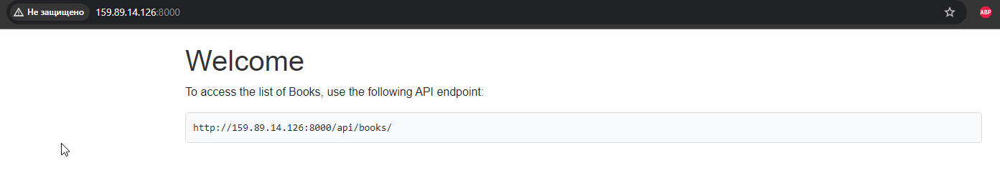
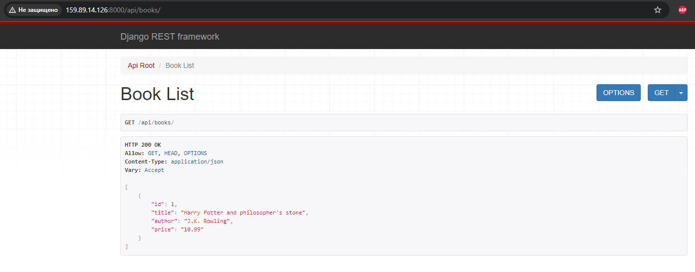
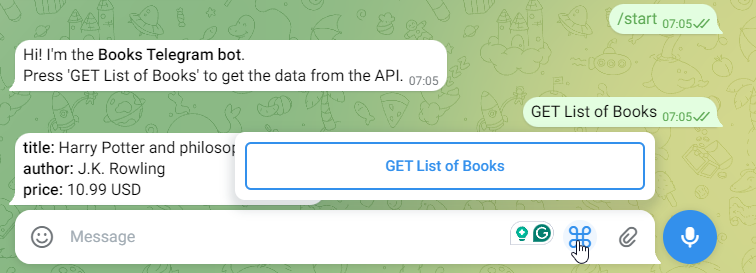

# drf-telegram-task

This is Django/DRF/Telegram test task project.

## Features
- Single Static Page: A Django template serves a static page.
- Books API Endpoint: An API endpoint in Django REST Framework that provides a list of books.
- Telegram Bot: A Telegram bot that interacts with the API endpoint.
- PostgreSQL Database: PostgreSQL is used as the database for the Django application.
- Docker: Docker is utilized for containerizing the application, simplifying deployment and management.
- Digital Ocean Deployment: The project is deployed on a Digital Ocean droplet.

## Prerequisites to start project locally
- Docker
- Docker Compose
- Telegram Bot API Token

But since it's in docker containers, you will only need to know few linux commands to do it on Digital Ocean server by yourself (need to install docker, docker-compose)

## Setup and Installation
1. Clone the Repository:
    ```shell
    git clone https://github.com/panicua/drf-telegram-task.git
    cd drf-telegram-task
    ```
2. Configure Environment Variables:
    ```shell
    cd .env.sample .env
    ```
   Don't forget to change to your **TELEGRAM_TOKEN**, **HOST_BASE_URL**, etc.
3. Build and run with Docker:
    ```shell
    docker-compose build
    docker-compose up
    ```

## Credentials that I've preloaded for you (local setup):
I changed credentials of admin user for the DEMO server I added below for safety reasons.
- admin user: admin;admin (http://localhost:8000/admin)
- Front page url: http://localhost:8000/
- API page endpoint (GET): http://localhost:8000/api/books


## Demo with my deployed application:
- Front page url: http://159.89.14.126:8000/
- API endpoint url (GET): http://159.89.14.126:8000/api/books/
- Telegram Bot: @DjangoBookServiceBot

### Screenshots
Main page


API page


Telegram bot

